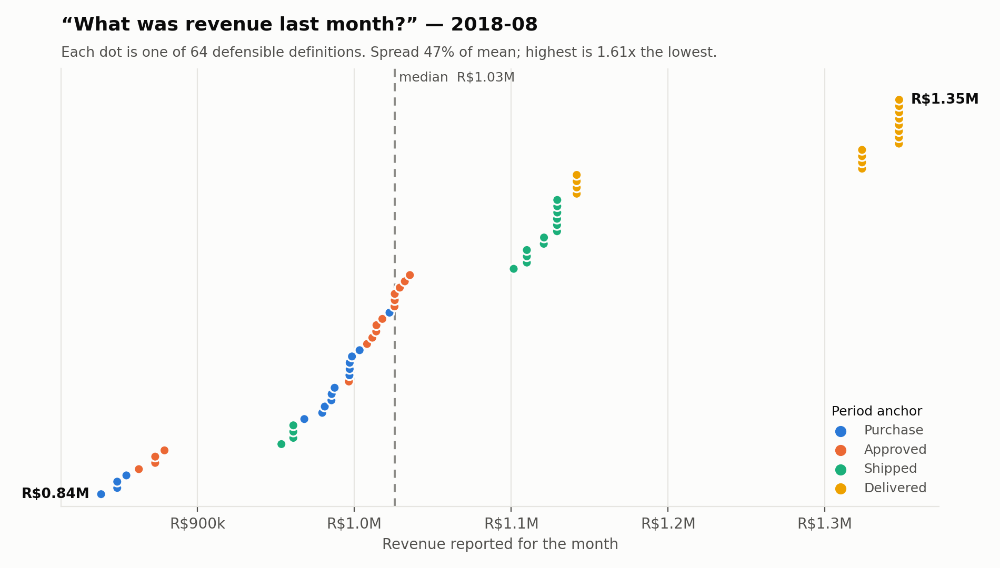
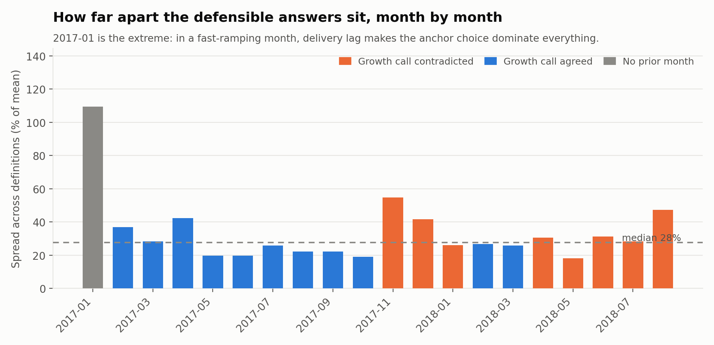
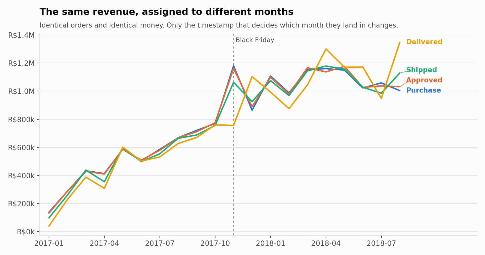
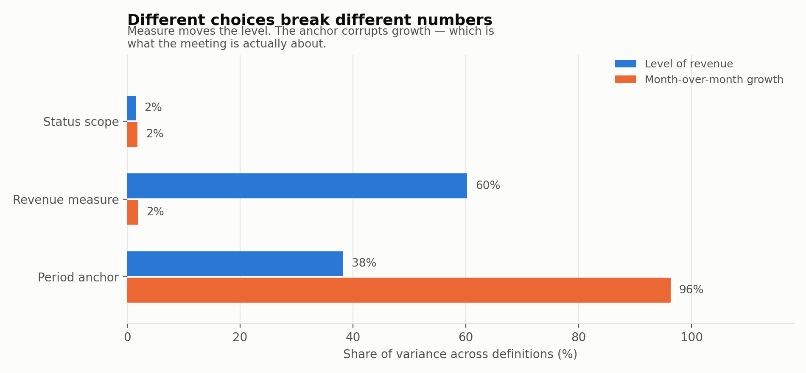
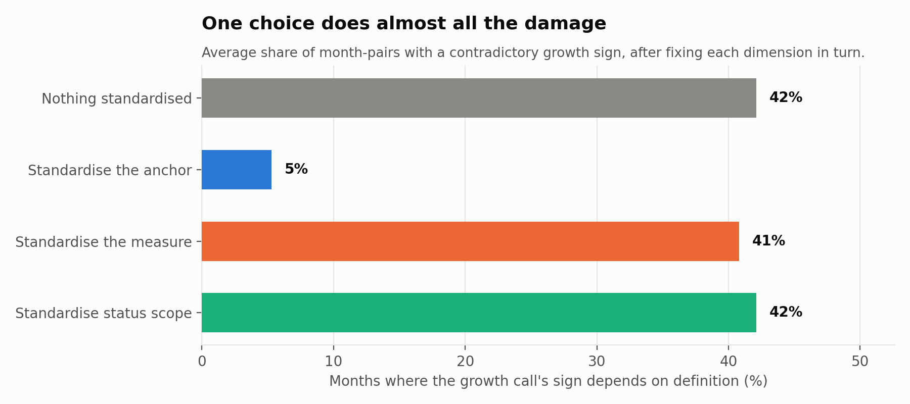

# How much does "last month's revenue" actually vary?

**A definition-sensitivity audit of the Olist Brazilian e-commerce dataset.**
99,441 orders · 20 complete months (Jan 2017 – Aug 2018) · 64 admissible
definitions · August 2026

---

## 1. The question

Two teams report last month's revenue. The numbers differ. A week disappears into
reconciliation, and the answer is almost always "we defined it differently."

Everyone in analytics knows this happens. There is no public artifact that says
**how much** — no measured spread, no attribution to which choice caused it, and
no evidence about which single standardisation would fix the most.

This is that measurement, run on a real e-commerce dataset with genuine
ambiguity rather than a contrived one.

The method is deliberately borrowed from experiment design: enumerate the
defensible variants, hold everything else fixed, measure the spread, then attribute
it. The primary metric is not the spread itself but **how often the spread changes
a decision.**

## 2. Data

[Olist's public Brazilian e-commerce dataset](https://github.com/olist/work-at-olist-data),
taken from Olist's own GitHub organisation rather than a third-party mirror.
99,441 orders placed between September 2016 and October 2018, with line items,
payments, customers, and five separate timestamps per order.

It is a good subject precisely because its ambiguity is real and not manufactured:

| Feature | Count | Why it creates a fork |
|---|---:|---|
| Orders | 99,441 | |
| Freight as a share of gross merchandise value | 14.24% | Product revenue or gross revenue? |
| Cancelled orders | 625 | Retroactively removed, or never counted? |
| "Unavailable" orders | 609 | A second terminal non-fulfilment state |
| …of which have **no line items at all** | 603 | Invisible to an items-based total, present in a payments-based one |
| Orders in payments but not items | 775 | The two revenue sources are not the same population |
| Multi-item orders | 9.94% | Order or item as the unit? |
| Multi-seller orders | 1.30% | Whose revenue is it? |
| Orders missing the approval timestamp | 160 | An anchor you cannot always use |
| Orders missing the delivery timestamp | 2,965 | |
| Voucher payments | R$379,437 | Consideration received, or contra-revenue? |

Items-based and payments-based totals agree to within 0.011% in aggregate — but
only **99.54% of individual orders** match exactly. The aggregate agreement is
what makes this dangerous: the two sources look interchangeable until someone
filters.

**Boundary months are excluded.** Olist's export is partial at both ends (4, 324
and 1 orders in the first three months; 16 and 4 in the last two). Including them
would manufacture spread that is an artifact of the export, not of definitions.
The analysis window is the 20 months from 2017-01 to 2018-08, defined by a
pre-registered threshold of ≥500 orders per month.

## 3. The admissibility rule

The headline of a definition-sensitivity study is trivially inflatable: add absurd
variants and the spread grows without bound. So the rule comes first, and it is
enforced in code and in the test suite.

> **A definition is admissible if and only if you can state a concrete business
> context in which a competent analyst would prefer it over the alternatives.**
> "Someone might do this by accident" is not sufficient.

### Admissible dimensions

| Dimension | Levels | Rationale for each |
|---|---|---|
| **Period anchor** | purchase · approval · carrier handoff · delivery | bookings view · cash view · fulfilment view · revenue-recognition view (control transfers on delivery under IFRS 15 / ASC 606) |
| **Revenue measure** | items+freight · items only · paid total · paid ex-voucher | gross merchandise value · product revenue · total consideration · net of previously-granted discounts |
| **Status scope** | all · exclude cancelled · exclude cancelled+unavailable · delivered only | gross bookings (never revises) · net of cancellation · net of both terminal failures · conservative recognised revenue |

4 × 4 × 4 = **64 admissible definitions.** Freight is only toggleable on the items
source and vouchers only on the payments source, so the measure dimension folds
those into four mutually exclusive levels.

### Rejected, and why

| Rejected | Reason |
|---|---|
| Anchor on estimated delivery date | A forecast, not an event. The month a sale lands in could change without anything happening. |
| Anchor on shipping limit date | A seller SLA deadline; exists even for orders never shipped. |
| Anchor on review creation date | Optional, arbitrarily late, and biased toward customers who review. |
| `sum(payment_value * installments)` | Double counts; installments describe a schedule, not an amount. |
| Summing payment rows without deduplicating order_id | A fan-out join bug, not a definition. |
| Freight toggle on the payments source | `payment_value` is not decomposable, so the toggle is undefined rather than merely unusual. |
| Counting each line item as an order for AOV | A unit-of-analysis error. 9.94% of orders are multi-item, so it silently redefines the denominator. |

## 4. Result 1: the spread



For **August 2018** — the last month with complete coverage under all four anchors —
the 64 admissible definitions produce answers from **R$838,577 to R$1,347,361**.

| | |
|---|---:|
| Lowest | R$838,577 · `purchase · items only · delivered only` |
| Median | R$1,025,772 |
| Highest | R$1,347,361 · `delivery · items+freight · delivered only` |
| Absolute gap | **R$508,784** |
| Spread as % of mean | **47.2%** |
| Highest ÷ lowest | **1.61x** |

August is above typical. Across all 20 months the **median spread is 27.5%**, with
a range of 18.2% to 109.4%.



The 109.4% outlier is January 2017, and it is instructive rather than anomalous:
in a fast-ramping month, orders purchased in January are delivered in February, so
a delivery-anchored January captures a fraction of a purchase-anchored one. The
spread is largest exactly when the business is changing fastest — which is when
anyone is looking.

**Average order value** behaves similarly at smaller amplitude: R$131.25 to
R$162.06 in August 2018, a median spread of 18.5% across months.

## 5. Result 2: the anchor moves revenue between months



Every line above is the same orders and the same money. The only difference is
which timestamp decides the month.

November 2017 is the clearest case. Black Friday orders are *purchased* in
November and *delivered* in December, so a purchase-anchored November spikes to
R$1.19M while a delivery-anchored November is flat at R$0.76M and the spike
appears a month later. Both are correct. Reported side by side under one label,
they are a fight.

The same mechanism runs in reverse at the end of the series: August 2018's
delivery-anchored total is inflated by a backlog of July purchases clearing.

## 6. Result 3: different choices break different numbers



Decomposing the within-month variance across definitions:

| Choice | Share of variance in the **level** | Share of variance in **MoM growth** |
|---|---:|---:|
| Period anchor | 38.2% | **96.3%** |
| Revenue measure | **60.2%** | 1.9% |
| Status scope | 1.5% | 1.8% |

This dissociation is the analytical core of the report.

The **measure** dimension applies a roughly constant multiplier every month —
freight is ~14% of gross more or less always — so it shifts the level substantially
and the growth rate barely at all. The **anchor** dimension does something
categorically different: it *relocates* revenue between months. Levels and growth
rates therefore have almost disjoint failure modes.

Status scope turns out to matter for neither, which is worth stating plainly:
cancellations are 1.24% of orders, and the cancellation policy is the argument
teams have most often. It is close to irrelevant to both numbers.

## 7. Result 4: the decision metric

Spread is only interesting if it changes an answer. For each of the 19
month-over-month comparisons, we computed growth under all 64 definitions and
asked whether they agree on the **sign**.

**Eight of nineteen (42%) contain a contradiction** — at least one defensible
definition says the business grew and another says it shrank, over the same
period, from the same rows: 2017-11, 2017-12, 2018-01, 2018-04, 2018-05, 2018-06,
2018-07, 2018-08.

Then the actionable question: if a team standardises exactly one dimension, how
much of that goes away?



| Standardise… | Contradicted month-pairs | Median spread |
|---|---:|---:|
| Nothing | 42.1% | 27.5% |
| **Period anchor** | **5.3%** | 16.9% |
| Revenue measure | 40.8% | 12.0% |
| Status scope | 42.1% | 25.7% |

Fixing the anchor alone removes nearly all disagreement about *direction*. Fixing
the measure alone removes the most disagreement about *level* and almost none
about direction. Fixing status scope does approximately nothing.

Fix the anchor **and** the measure, and let cancellation policy vary freely: across
all 16 combinations, contradictions fall to **0–2 of 19** and residual spread to
**0–3.8%**. For the combination this report recommends (purchase anchor,
items+freight) it is **zero contradictions and 2.7% spread**. Two lines of policy
retire the problem.

## 8. Two adjacent traps

**Repeat-purchase rate is currently degenerate.** Olist issues a new `customer_id`
per order and keeps identity in `customer_unique_id`. The natural query returns:

| Definition | Repeat rate |
|---|---:|
| `customer_id` | **0.00%** (0 of 99,441) |
| `customer_unique_id` | **3.12%** (2,997 of 96,096) |

This is worse than a definitional disagreement. It is a definition that is
structurally always zero, and zero is a plausible-looking answer for a young
marketplace — so it survives review. It is the single sharpest illustration in
this dataset of why "the query ran and returned a number" is not evidence.

**Delivery time spans 2.1x.** For August 2018, mean delivery time is between
**3.6 and 7.7 days** depending on whether the clock starts at carrier handoff or
purchase, and whether days are counted business or calendar. Median monthly spread
across definitions: 61.5%. Restricting to delivered-status orders changes nothing
at all — having a delivery timestamp already implies delivery — which is a
dimension we expected to matter and it does not. Reported honestly here because
that is the point of pre-enumerating rather than reporting what worked.

## 9. Limitations

- **The spread is conditional on the admissibility judgment.** Drop the delivery
  anchor from scope and the median spread falls to 20.5% and contradicted months
  from 8 to 4 of 19. Smaller; still material; same recommendation.
- **One dataset, one vertical.** A marketplace with physical delivery has an
  unusually long gap between purchase and delivery, which is what gives the anchor
  its leverage. A SaaS or digital-goods business would likely show a smaller anchor
  effect and a proportionally larger measure effect. The method transfers; the
  magnitudes should not be quoted for another business.
- **No revision simulation.** Delivery-anchored months keep filling in after
  month-end, so a real reporting process would see a *third* source of variation
  that this study does not measure: the same definition, the same month, reported
  on different days. That is the natural follow-up and it would strengthen the
  recommendation rather than weaken it.
- **1,234 cancelled and unavailable orders carry R$269,735 in payment records.**
  Whether that money was refunded is not recoverable from this dataset, so the
  status dimension is measured as a reporting-scope choice, not as a cash fact.

## 10. What we would standardise

See [`METRIC_SPEC.md`](METRIC_SPEC.md) for the full specification. In brief:
purchase-anchored, items+freight, excluding cancelled and unavailable, order as
the unit, `customer_unique_id` as the identity key — with a separately-named
delivery-anchored series maintained in parallel for finance and never compared to
the first.

---

### Reproducing

```bash
make all        # profile -> engine -> analyze -> figures -> html
make test       # 17 quality gates
```

Every number in this report is generated by `src/analyze.py` into
`out/summary.json` and pinned by `tests/test_audit.py`. If the pipeline changes
and the headline numbers move, the tests fail and the prose is wrong — which is
the intended direction of that dependency.

**Source:** [Olist Brazilian E-Commerce Public Dataset](https://github.com/olist/work-at-olist-data)
(Olist's own GitHub organisation).
